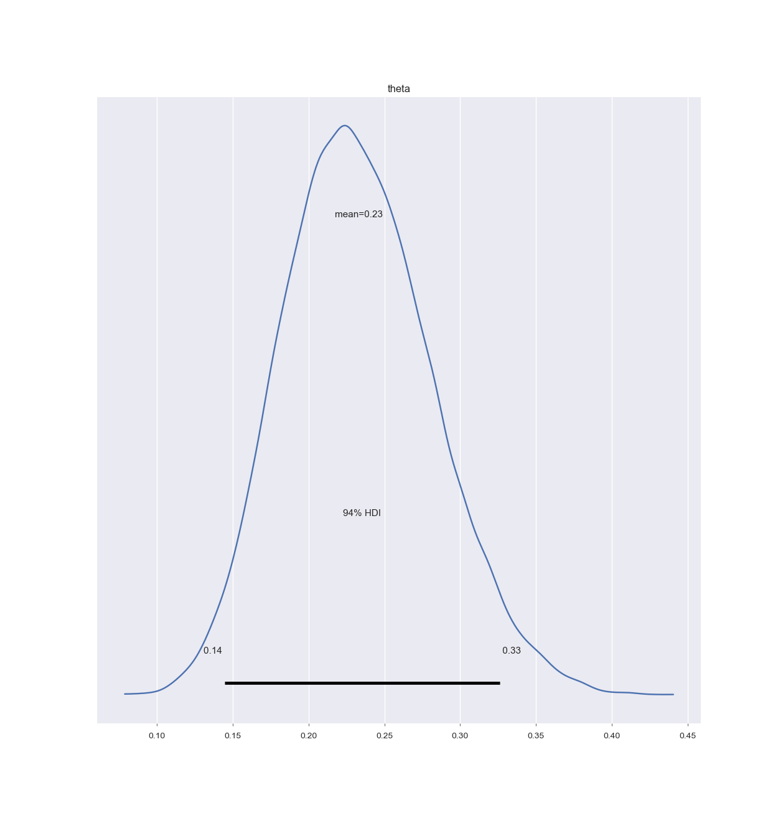

# mensa-rubbel


```bash
nix develop
```


Then, in the shell


```bash
python rubbel.py
```


Note that this analysis could have been done easily without using Stan or MCMC
but this way its just so much more fun. 🎉


## Current distribution


The posterior distribution given the currently available data looks like this:



